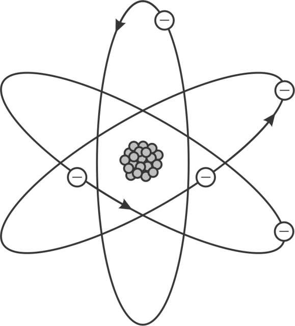

# Les Différentes Représentations des Atomes au Fil du Temps

## Les différents modèles atomiques

A travers les temps plusieurs représentation des atomes ont vu le jour.
Ces différents modèles ont prermis au scientifiques de leur époque de mieux comprendre les constituants de la matière.

### Proposition de Démocrite (460-370 av. JC) : "L'Atome"
Démocrite, un philosophe grec, est l'un des premiers à avoir théorisé l'existence de l'atome. Selon lui, la matière était constituée de petites particules indivisibles et éternelles, qu'il appela « atomes » (du grec « atomos », signifiant indivisible). Bien que cette idée ne fût pas fondée sur des observations expérimentales, elle introduisit le concept de la divisibilité de la matière. Démocrite imagina ces atomes comme étant en mouvement constant et en interaction les uns avec les autres. Il pensait que les différences de matières découlaient de variations dans la forme, la taille et l'agencement de ces atomes.

Même si ses idées furent en grande partie oubliées pendant des siècles, elles posèrent les bases de la pensée atomique et influencèrent des scientifiques comme John Dalton bien plus tard.

### Modèle de Dalton (1803) : "la sphère Indivisible" ou "la boule de Billard"

Le modèle de Dalton, en 1803, marque un tournant dans la compréhension de l'atome. Ce modèle repose sur la théorie atomique selon laquelle chaque élément chimique est constitué de particules indivisibles qui sont evidément les atomes. Celon Dalton il sont identiques entre eux pour un même élément et possèdent une masse spécifique. Ces atomes se combinent dans des proportions simples pour former des composés.

Dalton a formulé sa théorie en se basant sur les lois de la chimie, telles que la loi de la conservation de la masse et la loi des proportions définies. Dans ce modèle, l'atome est une sphère solide, homogène et indivisible. Bien qu'il n'ait pas pu observer directement les atomes, il a utilisé des données empiriques pour proposer cette vision.

### Modèle de Thomson (1897) : Le "Pudding au Raisin"

En 1897, J.J. Thomson fit une découverte révolutionnaire : il identifia l'existence de l'électron, une particule chargée négativement présente dans l'atome. Pour expliquer cette découverte, il proposa un modèle où l'atome serait une sphère de charge positive, dans laquelle des électrons seraient incrustés comme des "raisins" dans un "pudding".

Thomson se basait sur ses expériences de cathode ray et de déviation des électrons par un champ magnétique pour postuler l'existence des électrons. Son modèle cherchait à expliquer que l'atome était neutre malgré la présence de ces électrons. Il a introduit l’idée d'une répartition uniforme de la charge, mais il ne savait pas encore comment ces particules étaient disposées de manière plus précise à l’intérieur de l'atome.

### Modèle de Rutherford (1911) : Modèle Nucléaire

En 1911, Ernest Rutherford, à la suite de son expérience de la diffusion des particules alpha, modifia en profondeur le modèle de Thomson. Lors de cette expérience, il bombardait une fine feuille d'or avec des particules alpha, et remarqua que la plupart des particules passaient à travers la feuille, mais certaines étaient fortement déviées. Cela suggérait qu'une grande partie de la masse de l'atome était concentrée en un point très petit et dense, que Rutherford appela le noyau.

Rutherford conclut que l'atome devait être constitué principalement de vide, avec un noyau central contenant une charge positive. Les électrons, eux, orbiteraient autour de ce noyau. Ce modèle marquait un tournant en introduisant la notion de noyau atomique dense et central, et il est à l’origine de la compréhension moderne de la structure atomique.

### Modèle de Bohr (1913) : Modèle Planétaire

Niels Bohr, en 1913, chercha à résoudre une difficulté majeure du modèle de Rutherford : la stabilité des électrons en orbite. Selon la physique classique, les électrons devraient émettre de l'énergie et tomber dans le noyau en spirale, mais cela ne se produisait pas. Pour expliquer cela, Bohr proposa que les électrons ne pouvaient occuper que des orbites spécifiques, appelées "orbites stationnaires", où ils ne perdaient pas d'énergie.

Il introduisit l'idée que ces orbites étaient quantifiées : les électrons ne pouvaient exister que dans des niveaux d'énergie bien définis. Lorsqu'un électron passait d'un niveau d'énergie à un autre, il émettait ou absorbait de l'énergie sous forme de photons. Ce modèle expliquait non seulement la stabilité des atomes, mais aussi les spectres d'émission observés pour différents éléments.

### modele de Schrödinger (1926) : Modèle quantique

Le modèle de l'atome a été radicalement transformé dans les années 1920 avec l’émergence de la mécanique quantique. En 1926, Erwin Schrödinger proposa une approche où les électrons ne sont plus considérés comme des particules se déplaçant sur des orbites fixes, mais comme des "nuages" de probabilité. Grâce à une équation mathématique appelée l'équation de Schrödinger, il fut possible de décrire la probabilité de trouver un électron dans une certaine région autour du noyau, plutôt que de prédire une trajectoire exacte.

Ce modèle intégrait les principes de la mécanique quantique, qui stipulent que les électrons ont à la fois des propriétés de particules et d'ondes. Les électrons sont donc décrits par des orbitaux, qui sont des zones de haute probabilité où l'on trouve les électrons. Ce modèle a permis de mieux comprendre les interactions à l'échelle atomique et reste la base de notre conception moderne de l'atome.

## La "Vraie" Apparence des Atomes : Imagerie avec le Microscope à Effet Tunnel (STM)

En raison de leur taille minuscule, les atomes ne peuvent être observés directement avec des microscopes optiques classiques. Cependant, le microscope à effet tunnel (STM), inventé dans les années 1980, a permis de "visualiser" les atomes en utilisant des principes de la mécanique quantique. Le STM fonctionne en détectant le courant électrique qui tunnelise à travers une fine pointe placée au-dessus d'une surface. Cela permet de créer des images des électrons et de leur distribution sur la surface atomique.

Bien que ces images ne montrent pas les atomes tels qu'on pourrait les imaginer à l’œil nu, elles révèlent la probabilité de la position des électrons dans le matériau. Par exemple, des images du graphite ou des atomes d’hélium ont permis de confirmer la théorie des orbitales et de visualiser la structure atomique de manière indirecte.

 

_image d'un atome d'helium_

Ces images sont créées par une technique où un électron est projeté à travers une surface atomique pour révéler sa structure. Elles ne montrent pas les atomes de manière réelle, mais plutôt la probabilité de la présence des électrons autour du noyau.

_image du graphite visualisé par microscope a effet tunnel_

## Conclusion

À travers l’histoire, plusieurs modèles de l'atome ont été proposés, et chacun a permis d’avancer dans la compréhension de la matière. Voici un récapitulatif des principales représentations :

| Modèle                | Année  | Description |
|-----------------------|--------|-------------|
| Dalton                | 1803   | L'atome est une sphère indivisible, unique pour chaque élément. |
| Thomson               | 1897   | L'atome est une sphère de charge positive avec des électrons répartis. |
| Rutherford            | 1911   | L'atome a un noyau central dense et des électrons en orbite. |
| Bohr                  | 1913   | Les électrons occupent des orbites fixes avec des niveaux d'énergie quantifiés. |
| schrödinger           | 1926  | Les électrons sont décrits par des "nuages" de probabilité appelés orbitaux. |

## Aide :

### Rayon cathodique
Les rayons cathodiques sont des faisceaux de particules chargées négativement (électrons) émis par une cathode dans un tube à vide. Ils ont été utilisés par Thomson pour identifier l'électron.

